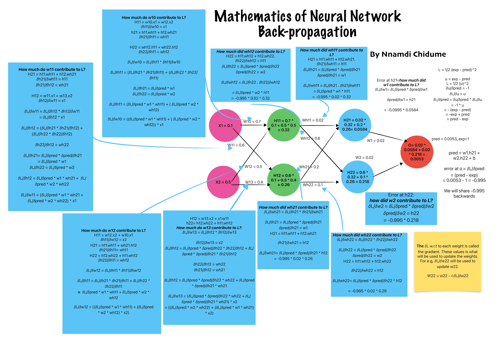

# Mathematics of Neural Network Back-propagation

An intuitive, cross-verified reference graphic detailing the multivariate chain rule and split-path gradient accumulation in fully connected layers.

## 📊 Visual Reference Sheet

## 📄 Complete Math Verification Companion (PDF)

If you want a cleanly typeset, step-by-step mathematical breakdown of every single weight gradient derivation shown in the graphic above, you can view or download the complete companion sheet:

👉 **[Download the Math Verification PDF (A4 Landscape)](Artificial_Neural_Network_BackProp.pdf)**
