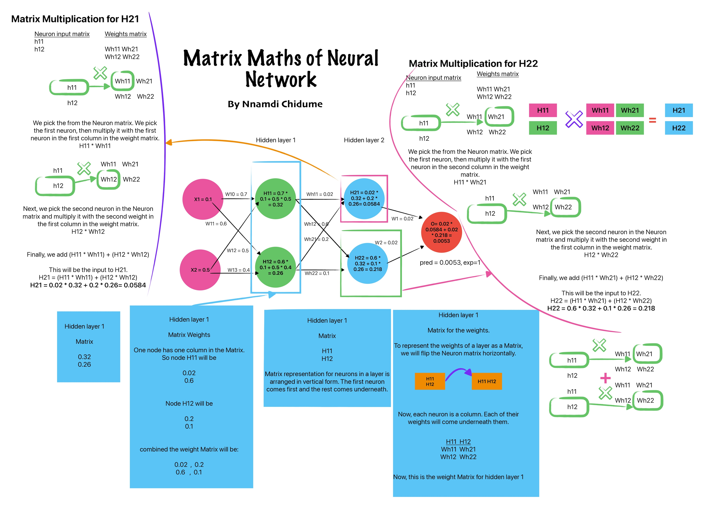

# Mathematics of Neural Network Back-propagation

An intuitive, cross-verified reference graphic detailing the multivariate chain rule and split-path gradient accumulation in fully connected layers.

## Visual Reference Sheet

  

  

---

## Complete Math Verification Companion (PDF)

If you want a cleanly typeset, step-by-step mathematical breakdown of every single weight gradient derivation (`w₁₀`, `w₁₁`, `w₁₂`, and `w₁₃`) shown in the graphic above, you can view or download the complete companion sheet:

**[Download the Math Verification PDF (A4 Landscape)](Artificial_Neural_Network_BackProp.pdf)**
**[Download the "Matrix Math of Neural Network" PDF (A4 Landscape)](Matrix_Maths_of_Neural_Network.pdf)**

---

## Core Takeaway
Unlike simplified textbook examples that showcase a single isolated stream, this repository documents a fully connected architecture. When a hidden unit node forks into multiple forward pathways, its backward pass **must sum the incoming gradients** from all connecting branches. This repository provides the exact mathematical derivations proving that relationship.
